# Lab Report for Assignment 1

### Name: Michelle Weber
### Email: mw224hw@student.lnu.se
\
[image source](https://sparksupport.com/blog/fun-with-bash-scripting/)

## Table of Contents
1. [Customizing my environment](#customizing-my-environment)
    + [Setup](#setup)
    + [Customization](#customization)
    + [Aliases](#aliases)
2. [Backup Script](#backup-script)
    + [Code Explanation](#backup-script)
    + [Questions](#questions)
      + [Question 1](#question-1-would-it-be-possible-to-enhance-the-naming-of-the-backupfile-so-it-relates-to-the-directory-being-backed-up-how-would-you-then-name-the-backupfile)
      + [Question 2](#question-2-is-it-possible-to-add-a-timestamp-to-the-backup-so-you-could-take-several-backups-without-overwriting-the-existing-ones-how-would-then-the-filename-look-like)
    + [Sourcecode](#sourcecode)
    + _[Important Note](#important-note-please-read-before-moving-further)_
3. [File Size Analyser Script](#file-size-analyser-script)
    + [Code Explanation](#file-size-analyser-script)
    + [Questions](#questions-1)
      + [Question 1](#question-1-reflect-on-the-final-code-and-consider-if-this-could-be-implemented-as-a-one-line-command-are-one-line-commands-good-or-bad)
    + [Sourcecode](#sourcecode-1)
4. [Text Analyser Script](#text-analyser-script)
    + [Code Explanation](#text-analyser-script)
    + [Questions](#questions-2)
      + [Question 1](#question-1-reflect-on-your-final-code-is-it-good-and-clean-or-do-you-see-improvement-areas)
      + [Question 2](#question-2-do-you-see-any-security-risks-in-downloading-and-analysing-a-file-like-this-consider-you-are-printing-out-details-of-the-file-into-the-terminal-could-this-be-used-to-attach-your-system-if-there-is-a-threat-can-you-protect-your-application)
    + [Sourcecode](#sourcecode-2)
5. [Extend Existing Example Script](#extend-existing-example-script)
    + [Code Explanation](#extend-existing-example-script)
    + [Questions](#questions-3)
      + [Question 1](#question-1-reflect-on-the-cli-code-and-compare-it-to-other-programming-languages-you-have-learnt-talk-about-the-similaritydifferences-and-what-is-goodbad)
    + [Sourcecode](#sourcecode-3)
6. [How to learn Linux](#how-to-learn-linux)
    + [Question](#question-lets-say-you-have-a-friend-that-wants-to-learn-unix-and-the-shell-what-would-be-your-suggestion-to-your-friend-on-the-five-most-important-steps-to-start-learning)
7. [Shellcheck](#shellcheck)
8. [TIL](#til-today-i-learned)
9. [References](#references)
10. [Other useful links](#other-useful-links)
    + [Linux-related](#linux-related)
    + [IEEE usage](#ieee-usage)

## Customizing my environment
### Setup
The operating system, that I used for this assignment is Linux Mint. The terminal I use is kitty and the shell is zsh.\
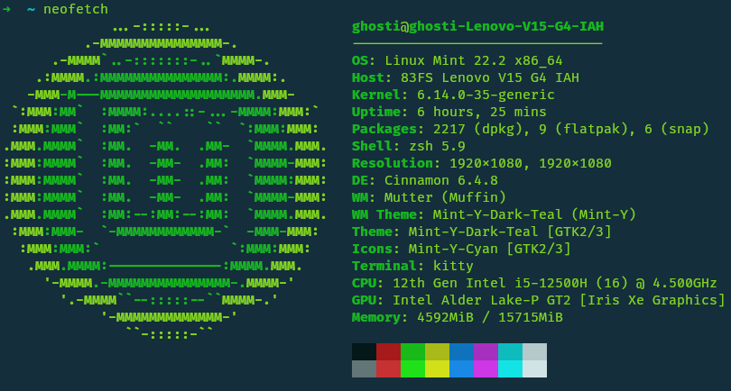
### Customization
[oh-my-zsh](./images/customize/omz.png) does already a lot of customization.
The default prompt in this shell can be changed in the `.zshrc` file. My initial theme was "robbyrussell" as seen in the [.zshrc file snippet](./images/customize/zsh_theme.png) but lets change it to ["Anka says: "](./images/customize/update_PS1.png). To achieve this, the .zshrc file has to be changed like [this](./images/customize/update_PS1_in_file.png). Since I prefer the original, I will now change it back to the initial design.\
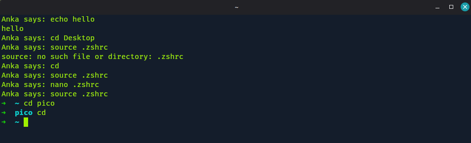\
I also already use a customized version of the terminal that makes noises when doing certain things. So, if I for e.g. type `cd` and then press `tab` it makes a water drop noise.\
The [theme of the kitty terminal](./images/customize/kitty_themes.png) can be chosen by using the command `kitty +kitten themes`. There are so many themes to choose from. The one that I chose is called "Box". The font that I use is called "Fira Code".
### Aliases
Just like in the customization part, the aliases have to be set in the `.zshrc` file. I have written them on the bottom of the file. The initial aliases that I created, look like this now:\
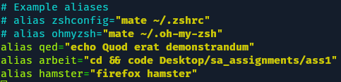\
(to see the full screen file [click me](./images/alias/alias_edit_zshrc.png))\
In order to make those aliases work, I used `source ~/.zshrc` but restarting also works fine. Without doing any of that the shell doesn't recognize the newly added aliases. I need to make it so the shell reads the file `.zshrc` again.\
The first one just prints a phrase in the terminal. The second one opens this assignment on my local machine in vs code. The third one does not work properly. I have realized that later as this does not open DuckDuckGo search, but rather "https://hamster", which doesnt work. Therefore, I have corrected it.\
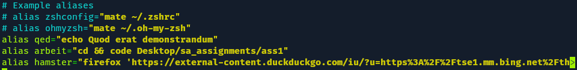\
Now, it redirects me to an image link of a hamster image that I found online.\
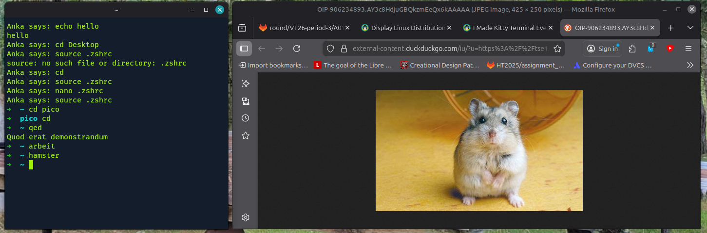\
Why is a link to a hamster useful? It's not particularly about the link. I do personally like hamsters, so this is a funny gimmick but it's also teaching me how links and the firefox command properly work together. I did not know that before and have therefore, documented my mistake here aswell.

## Backup Script
It took quite some time and experimenting but the script [backup.bash](./scripts/backup.bash) should be error prune and create the backup in the correct file now.\
The script will search for the directory that was entered inside the cwd (current working directory) and take the first one it finds. Since the task didn't specify. To search the system for a directory I used:
```bash
    find "$HOME" -type d -name "$1" -print -quit 2>/dev/null
```
which was mentioned in [[1]](#references).

To execute the script, you type:
```bash
    bash path/to/backup.bash path/to/desired/directory
```
After the backup file has been created successfully, it prints the elapsed time, a confirmation that it was created and the name of the file.
Below is a image of the execution of the initial version of it, that required sudo access. I have changed it in the final version, since (for some reason) now `mv` at first needed it and then didn't anymore..\
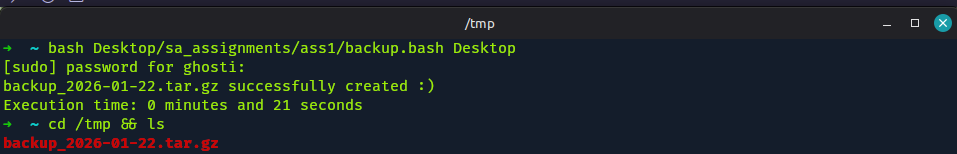\
Here is the recreation of the creation of the backup using the current (safer) version of the script.\
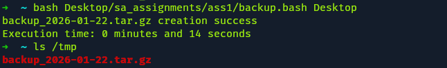\
As visible, execution time has improved aswell. What has changed? I removed the `find` command that searches the entire HOME directory for the entered folder, preventing possible system crashes due to too intense searches. If the HOME directory is really big, it could lead to system crashes when using `find` like my old version of the backup script was using. Searching less, also needs less time, according to [[3]](#references). My HOME directory has almost nothing, so I got lucky when using the old script. The old backup script can be seen [here](./scripts/old_backup_scripts/second_backup.bash).

For the error handling aspect of the script, I have used Method 1 from [[2]](#references). Below is a snippet of the backup script, where the system will only return true if the input directory (`$1`) exists. Otherwise, it will print the custom error message and ends the program prematurely with exit value 1, which means fail.
```bash
    if [ ! -d "$1" ]; then
        echo "Directory not found."
        finish_time "$SECONDS"
        exit 1
    fi
```
I have done some error testing on the script to see what happens if there are too little or too much arguments, if the directory doesn't exist, and what happens if the backup already exists. All seem to work fine and print a custom error message together with the elapsed time. I was unsure if the elapsed time was needed for error cases aswell, but the task didn't argue against it so I left it in.\
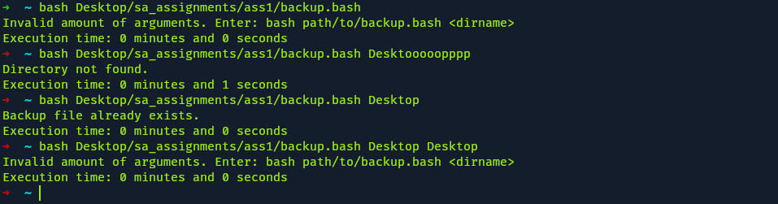

To also prevent bash output and making sure only my custom error messages appear (and NOTHING else). I have looked at [[4]](#references), which uses:
```bash
    2>/dev/null
```
To show an actual usage of this inside my script, we can look at line 46 of [backup.bash](./scripts/backup.bash):
```bash
    mv backup_"$DATUM".tar.gz /tmp 2>/dev/null
```
There, the backup file gets moved from the current working directory into `/tmp`. To explain `2>/dev/null`, according to [[4]](#references), `2>` is used when you want to redirect errors. Any error output will be redirected to the "null device", which is, as the name implies, basically sends everything into the void that it receives.\
The script also needed the current date in its name. As visible in the above code snippets, im using the variable `$DATE` but never mentioned how it is created. According to [[6]](#references), you can add any date related information using the `date` command combined with other specific arguments to filter what information you want. I have used it like this:
```bash
    DATUM=$(date +%Y-%m-%d)
```
This way, I get the format year-month-date in one argument and store it on `DATUM`.\
To calculate the elapsed time, i have used a custom function. According to [[5]](#references), you calculate the time like this:
```bash
    SECONDS=0
    # do some work
    duration=$SECONDS
    echo "$((duration / 60)) minutes and $((duration % 60)) seconds elapsed."
```
In my script, I have used a similar way. Only that I have split it up, and used a custom function, like [[7]](#references) explained, that I then can call from anywhere inside the script.
```bash
    finish_time () {
        DURATION=$1
        MIN=$((DURATION / 60))
        SEC=$((DURATION % 60))
        echo "Execution time: $MIN minutes and $SEC seconds"
    }

    # START TIMER
    SECONDS=0
```
The function also takes an argument. However, I have not done any error handling for that specific function, since it will only be used inside the script. It must not be used outside the script!

### Questions
#### **Question 1:** Would it be possible to enhance the naming of the backupfile so it relates to the directory being backed up? How would you then name the backupfile?

Yes, it is possible to do that! I would most likely take argument `$1` and extract the basename of it to it inside the filename. `$1` stands for the input the user gives when using the command to execute the `backup.bash` script. So, `$1` is the name (or path included) of the directory. Some users might enter directories like `./folder` or `path/to/folder`, which would mess up the name if I would only use `$1` inside the name of the backup. Therefore I must use
```bash
    DIR_NAME=$(basename "$1")
```
inside the script. So, instead of `backup_"$DATUM".tar.gz` it could be for e.g. `backup_"$DIR_NAME"_"$DATUM".tar.gz`.\
Example: In the Home directory, I enter:
```bash
    bash Desktop/sa_assignments/ass1/backup.bash Desktop/HamsterImages
```
and today's date is 2026-01-22. So, the corresponding backup file would be `backup_HamsterImages_2026-01-22.tar.gz`.

#### **Question 2:** Is it possible to add a timestamp to the backup so you could take several backups without overwriting the existing ones? How would then the filename look like?

Of course, it is possible. I could combine that time with the date that I already use in my script. [[6]](#references) already explains this in full detail.\
I can get that full timestamp by changing the systax from 
```bash
    DATUM=$(date +%Y-%m-%d)
```
to
```bash
    DATE=$(date -d "today" +"%Y%m%d%H%M%S")
```
You could also change the variable for better logic into something like "TIMESTAMP", or change the syntax to have "-" inbetween the numbers. A lot of customization is possible, but I would do it like mentioned above.\
Example: I am currently in the Home directory and I enter:
```bash
    bash Desktop/sa_assignments/ass1/backup.bash Desktop
```
Today's date is 2026-01-22 and the time at that exact moment is 03:26:59 (Format HOURS:MINUTES:SECONDS). So, the corresponding backup file would be `backup_Desktop_20260122032659.tar.gz`.

### Sourcecode
[backup.bash](./scripts/backup.bash)

### Important Note (Please read before moving further!)
My filestructure, when creating and running the bachup.bash script was different than when I was doing the tasks below. My original file structure (at the point of creating and running backup.bash) was:

    Desktop/
        sa_assignment/
            README.md
            ass1/
                images/
                backup.bash
                notes.txt
                Report.md

Therefore, the screenshots and mentioned execution syntax when running backup.bash, and when running the other scripts **below**, will **differ**. The new file structure is just like the repository.


## File Size Analyser Script
In this task, I had to write a bash script named [large_files.bash](./scripts/large_files.bash). It takes a directory path as an argument.
I also made sure it cannot take more or less arguments by implementing some error handling like this:
```bash
    if [ "$#" -ne 1 ]; then
        echo "Invalid amount of arguments. Only 1 argument needed (DIR)"
        exit 1
    fi
```
This snippet makes sure that the user does not enter more or less than 1 argument. Otherwise it will print a custom error message in the terminal and exit the script prematurely. `exit 1` means failure.\
I also made sure that the entered argument from the user is actually an existing directory and not a file or something non-existent. This is how I implemented it:
```bash
    if [ ! -d "$1" ]; then
        echo "Directory not found."
        exit 1
    fi
```
This will check the input argument `$1`. If it is not a directory or it doesn't exist, the program again, will exit prematurely with `exit 1` and print a custom error message in the terminal.\
I have implemented the error handling the same way as in the first task. [[2]](#references) was a quite useful ressource to read for this topic.

After the error handling for the input argument, the script will search the directory recursively for all files. I also made sure to store all those file paths inside a variable for later use. In the last task, I have used the `find` command before but then decided to delete it. However, this found knowledge won't be wasted, as I have used it in this task. I have initially wrote this:
```bash
    ALL_FILEPATHS=$(find "$1" -type f 2>/dev/null)
```
However, this is absolutely wrong, and I had to find that out the hard way.\
Later on I wrote this:
```bash
    for FILE_PATH in $ALL_FILEPATHS
```
which caused a lot of crashes combined with the other line above. It now splits everything when there were spaces, so the paths would be broken. `ALL_FILEPATHS` is also not an array, which caused errors when extracting the data inside the for-loop. So, I rewrote the line with the `find` command like this:
```bash
    mapfile -t ALL_FILEPATHS < <( find "$1" -type f 2>/dev/null )
```
Using `mapfile`[[8]](#references), I can correct the previous mistake. Now, `ALL_FILEPATHS` is an array, and it really maps all paths separately onto the array `ALL_FILEPATHS`. `find` scans the directory recursively for files only, since I wrote `-type f`. The extraction of each file's data happens later in the for-loop[[9]](#references).
```bash
    for FILE_PATH in "${ALL_FILEPATHS[@]}"
    do
        FILENAME=$(basename "$FILE_PATH")
        SIZE=$(stat -c%s "$FILE_PATH")
        TYPEDATA=$(file "$FILE_PATH")
        IFS=':' read -ra TDATA <<< "${TYPEDATA}"
        TYPE="${TDATA[1]}"

        ALL_FILES+=("$FILENAME:$SIZE:$TYPE")

        (( COUNTER+=1 ))
        (( TOTALSIZE+=SIZE ))
    done
```
Here, the script extracts all data like filename, size, and information on the type. This will all be stored onto the `ALL_FILES` array. I separate the data using ":". The size gets extracted like this[[10]](#references):
```bash
    SIZE=$(stat -c%s "$FILE_PATH"  2>/dev/null)
```
and the typedata can be extracted by using a way to split the output in 2[[11]](#references), which I will explain later. Before, I need to explain how to get the typedata in the first place.\
When someone writes `file <path/to/file>`[[12]](#references) inside the terminal, they get something like this:\
\
It prints the input argument, then a ":", and then the information on the type of the file. I only need the information on the right side of the ":". Therefore, I need a way to split the output at the ":". In python, you wouldd write:
```python
    somestring.split(":")
```
which would split the string at the desired spot. In bash, this is a bit more complicated. According to [[11]](#references), the string can be split using:\
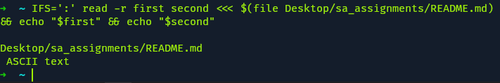\
So, I can now get both sides of the output separately. I dont need the filepath, so I will only use the second part of the output. Extracting things from an array is still the same as in python (almost). So, I will write:
```bash
    TYPEDATA=$(file "$FILE_PATH")
    IFS=':' read -ra TDATA <<< "${TYPEDATA}"
    TYPE="${TDATA[1]}"
```
to get the specific type data that will be needed for the task. For more explanation see [image](./images/file_analyser/AHAHAHAHAA.png) extracted from [[11]](#reference).

As visible in the for-loop snippet that I showed earlier, the script also increases the variable `COUNTER` each loop to count how many files the directory contains in total. The loop also contains another variable `TOTALSIZE`, which gets increased by the size of each file. This way, I get the total filesize of all files inside the target path.

When all is extracted and stored, the script sorts the `ALL_FILES` array, according to the file sizes, and stores it in `SORTED_FILES` like this:
```bash
    mapfile -t SORTED_FILES < <( 
        printf "%s\n" "${ALL_FILES[@]}" | 
        sort -t: -k2,2nr
    )
```
The `-t` stores the results[[8]](#references). [[13]](#references) uses `sort` to sort something, and `-k<number>` to sort after a specific number (which argument in the array). I also use `%s\n` to strip the newline, and I only want to do numeric sort of the second argument(key) in reverse (from biggest to smallest value), and I need a field separator (according to shellcheck), so I use `sort -t: -k2,2nr`.

The next task is to write the top 5 largest files onto a txt file. To do that I again use a for-loop but this time more primitively, by just writing 0 to 4 as the range, which was used in the examples from [[9]](#references). Why 0 to 4? Because indexes here work just like in python. 0 is the first element in the array, so I need to start from 0 and finish at 5-1 to get the top 5 elements in the array. I also use `IFS` again to split all my arguments in the `ALL_FILES` array. The report's name will be "largest_files.txt". As known from previous snippets, the format of the `ALL_FILES` array looks like this: `"$FILENAME:$SIZE:$TYPE"`.\
To write onto a file I made sure to create the file beforehand by writing `touch` combined like this:
```bash
    RESULTPATH="$1/largest_files.txt"
    touch "$RESULTPATH"
```
at the beginning of the script.\
Now, the data will be extracted with `IFS` and written onto the existing `largest_files.txt` using the examples from [[14]](#references) like this:
```bash
    for I in 0 1 2 3 4
    do
        IFS=':' read -ra DATA <<< "${SORTED_FILES[I]}"
        {
            echo "Filename: ${DATA[0]}";
            echo "Filesize: ${DATA[1]} Bytes";
            echo "Typedata:${DATA[2]}";
            echo ""
        } >> "$RESULTPATH"
    done
```
This will print the largest file first and the 5th-largest file last. Each file will be printed with its' name, size and typedata.\
Afterwards, it will write the total number of files, that were found, and the total size of all found files in the target path like this:
```bash
    {
        echo "Total amount of files: $COUNTER";
        echo "Total size: $TOTALSIZE Bytes"
    } >> "$RESULTPATH"
```
The task didn't specify where to save/create the file, so I decided to let it save in the place where the script was searching (the input argument path). This way, the report with the results get stored in the related path. It also makes it easier to create many reports in different places and have the data, where it it related. One could change it so it stores it all in one specific path. There are other possibilities.\
In case a user executes the script again, using the same input argument, the file will just be extended. I have made sure that the script writes an entry date, each time it gets executed. This way, the user can scroll through the report seeing how the top 5 have changed or if they even changed in the first place, compared to the last time, the user executed the script.\
Below is an example execution of the script:\
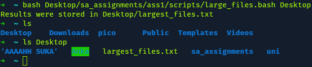\
As visible, the file has been stored not where it was executed but inside the directory where the analysis has been done. Just like it was mentioned previously.\
This is how the result file will look like for ONE execution:\
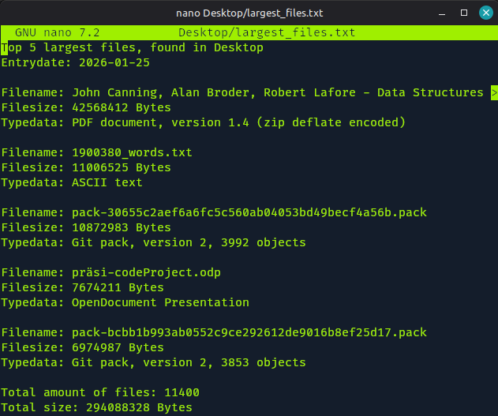

### Questions
#### **Question 1:** Reflect on the final code and consider if this could be implemented as a one line command? Are one line commands good or bad?
My code as it is could not be changed to a one line command, in my opinion. However, I know that my code is not the most efficient solution there is. There are many built-in GNU commands that I did not use in my soltion. This was, because I wanted to simplify my solution. I do not know a lot about bash and GNU. Therefore, it is a great approach to write simpler code instead of using built-in methods from the start. It teaches you how something works in greater detail.\
Now, if my code would have been made better, it would be entirely possible to make it into a one line command. I have talked to another student and his solution uses many built-in GNU features, which makes his code much shorter and much more efficient, compared to mine. If I would have improved my code like this aswell, using improved and built-in GNU methods to solve this task and write the script, I would have been able to write a one line command. So, yes, it is possible.

Are one line commands good? There are two different answers that depend on context.\
For scripting? No! There they are horrible to read, unnecessarily long, and debugging would be a really painful and time consuming. Shellcheck would most likely mark it as bad aswell. It is not recommended and is not good coding practise either.\
However, if you would use it for quick testing in the terminal using commands you don't plan on keeping, this would be absolutely fine. For example, something like this:\
\
to demonstrate something or test something quickly, it is useful. I didn't plan to keep it this way. I used this one line command to test the functionality and demonstrate the command in my report. In my script, I split it up into smaller bits and made it more readable and more fit for my specific plans.

### Sourcecode
[large_files.bash](./scripts/large_files.bash)


## Text Analyser Script
This task was about writing a script [analyse.bash](./scripts/analyse.bash) that takes a url as an argument to analyse specific factors of. It should also download the file and lastly open it in the browser of choice.\
The script can work with any binary files and text files. I made use of the mime type [[17]](#references) of the file to distinguish between the different files. This way, text and binary files are treated and analysed differently. I used if and else for that part:
```bash

    if [[ $MIMETYPE == text/* ]]; then
        # analyse text file

    else 
        # analyse image file
    fi

```
So the first case is if the mime type of the file is something with text, and the second case is for binary files. So when I write `file -mime--type` \<filename> [[17]](#references), I get something like this:\
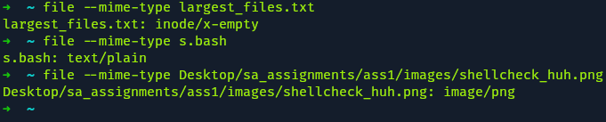\
With the mime type extracted, the program can differentiate between the types and I only need to know the first part of the output, so I wrote `text/*` meaning the program ignores the second part.

The next part is to find out how to download different files. According to [[15]](#references) there is the command `curl` but also `wget`.\
At first I tried using `wget` as it is in my [first attempt](./images/text_analyser/1st_attempt_download_image.png), which was quite interesting. I was able to download a file with just a link. However, it was not saved where I wanted it to be, but instead, where I executed the command. So, I tried to use other commands of wget to see what else it could do. My [second attempt](./images/text_analyser/2nd_attempt.png) was using `wget -P` to save it in a specific directory. You can also store it as a specific filename if you add the filename of your choice at the end. My [third attempt](./images/text_analyser/3rd_attempt_with_curl.png) was with `curl`. Using it combined with `-o` I could set a custom file name aswell. In my [fourth attempt](./images/text_analyser/4_curl_textwebsite.png) I used the previous command `curl -o` but combined it with `-s` to make the downloading output silent in the terminal. With that combination I was able to download and work with files quite well, so my initial command was:
```bash

    curl -s -o fil "$1" 

```
But `.exe` files (entering a download link for executable files) were a little different and have caused some errors. So, I have looked at other ressources and thought about changing the command by using `wget` instead [[16]](#references). So, my final command, was:
```bash

    wget -qO fil "$1" || { echo "Something went wrong"; exit 1; }

```

I have made the decision to store all the analysation results onto a txt file. Therefore I wrote
```bash

    touch fileanalysis.txt

```
at the beginning of the file, and used the aquired knowledge from previous tasks to write all the data onto the file like this: 
```bash

    {
        echo "Lines: $LINES"
        echo "Words: $WORDS"
        echo "Spaces: $SPACES"
        echo "First Line: $FIRSTLINE"
        echo "Last Line: $LASTLINE"
    } >> fileanalysis.txt

```
This snippet represents the results from the analysis of a text file. So, these are for file-specific analysis. The first part was:
```bash

    LINES=$(wc -l < "$F")
    WORDS=$(wc -w < "$F")

```
which counts all lines of the file and then all words [[18]](#references), and stores it onto the variables `LINES` and `WORDS` respectively. The next line is:
```bash

    SPACES=$(grep -o ' ' "$F" | wc -l)

```
which counts all spaces of a file. I used the `grep` command and then used `-o ' '` which will count all the times that a space (' ') occurs [[19]](#references). The next 2 lines are:
```bash

    FIRSTLINE=$(head -1 "$F")
    LASTLINE=$(tail -1 "$F")

```
which are to read the first (`head -1`) [[20]](#references) and the last (`tail -1`) [[21]](#references) line of a text file. After all this was analysed, it will be printed onto `filenalysis.txt` as mentioned one of the above snippets.\
For the binary files, I also used the command `LINES=$(wc -c < "$F")` to get the lines. But these files also require some different analysis than the text files. So, the next thing is to get the first ten bits of the file. Next, would be the last ten bits of the file. Which I wrote like this[[18]](#references)[[22]](#references):
```bash

    FIRSTTEN=$(head -c 10 "$F" | xxd -p)
    LASTTEN=$(tail -c 10 "$F" | xxd -p)

```
Notice that the end of each line uses `xxd -p`, which converts it to hex. This is so the first ten and last ten bits would be readable in the output. All results are written to `filenalysis.txt` like this:
```bash

    {
        echo "Lines: $LINES"
        echo "First 10: $FIRSTTEN"
        echo "Last 10: $LASTTEN"
        echo ""
        echo ""
    } >> fileanalysis.txt

```
However, there are some things that need to be analysed from both file types, which is the type, mime type, and size. These, I retrieve in the first part of the script, before the file-specific analysis. As known from the previous task, file types can be retrieved by using the `file` command [[12]](#references). The mime type can be retrieved using the commands mentioned in one of the above snippets, and the size can be retrieved using the command `stat -c%s <file>` [[10]]. So, all that is left to do is to retrieve the data:
```bash

    TYPE=$(file "$F" | cut -d: -f2-)
    MIMETYPE=$(file --mime-type -b "$F")
    SIZE=$(stat -c%s "$F" 2>/dev/null)

```
and to write it to `filenalysis.txt`:
```bash

    {
    echo "   ------ FILEANALYSIS ------"
    echo "Entrydate: $(date +%Y-%m-%d)";
    echo "URL: $1"
    echo ""
    echo "Type: $TYPE"
    echo "Mime Type: $MIMETYPE"
    echo "Size: $SIZE Bytes"
} >> fileanalysis.txt

```
Notice that I also mentioned the input url, a title, and an entry date. This is to make the file a little more visually appealing and readable. Nothing that was really required but still nice to look at for me personally.

The script also stores the file in the correct file, making use of the retrieved mime type:
```bash

    TP=$(file --mime-type -b "$F" | cut -d/ -f2)
    mv "$F" "$F.$TP"
    F="$F.$TP"

```
It might be primitive to just change the file name after the download, but the file itself is still the same file. It is just nice to have it correctly stored for cases when for e.g. it is getting opened on a system that doesn't know how to read the file otherwise.

When all is written into `filenalysis.txt` the script prints out a message that it has finsihed executing the previous tasks (whether that being correctly or incorrectly). It will then display that written file using:
```bash

    cat fileanalysis.txt

```
Afterwards, it will print another message indicating that it will now open the downloaded folder in firefox (webbrowser):
```bash

    echo "Opening local file in firefox..."
    firefox "$F" || { echo "Failed to open.. Do you have firefox?"; exit 1; }

```
Notice that there is also an error message in case the opening in firefox fails, to tell the user that something went wrong. It doesn't have to be that the user doesnt have firefox but it **could**.

The execution of the script using an imagelink will look something like this:\
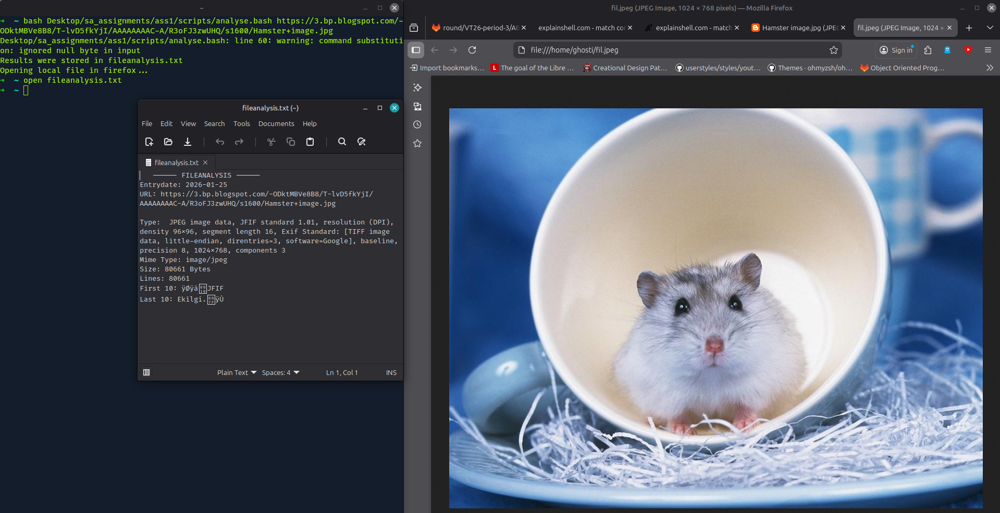\
The execution of the script using an 'average' link will look something like this:\
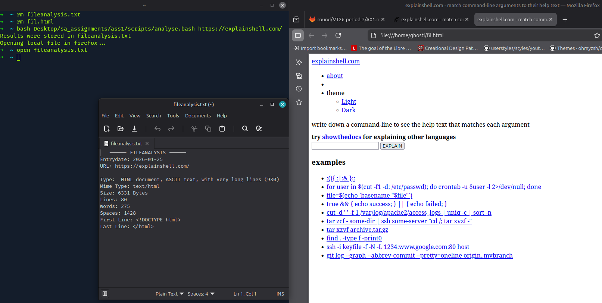\
NOTE: It may look a little different in the terminal, when executing it now, since the image has been taken before `cat` was added to the script to print the containments of `fileanalysis.txt` into the terminal.\
Here we see the downloaded file vs the original file:\
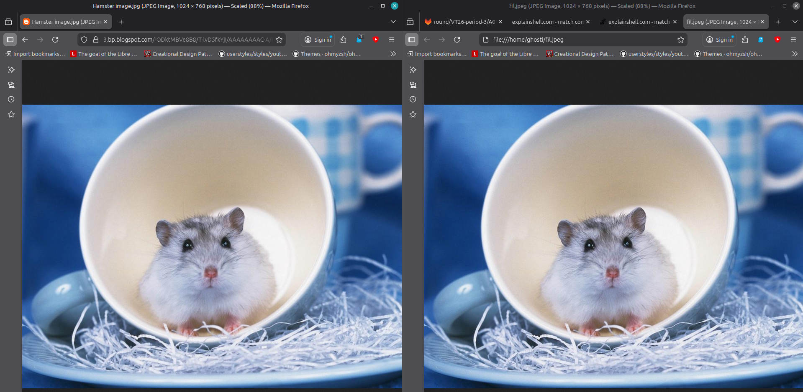
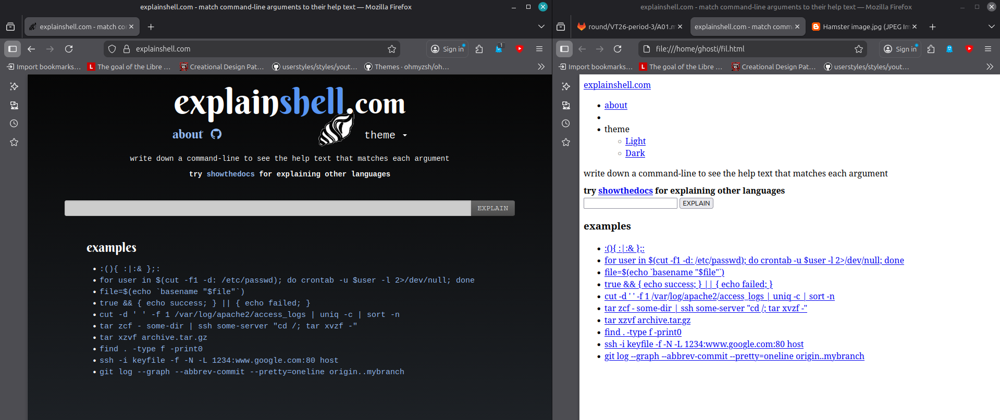\
As visible, there is a very large difference between the downloaded html file and the actual website, because for e.g. the style tool (e.g. css) was not downloaded and displayed in combination with the html file. However, the downloaded image doesn't seem to have any different appearance compared to the original.

### Questions
#### **Question 1:** Reflect on your final code, is it "good and clean" or do you see improvement areas?
A code is never really perfect, in my opinion. There is always room to improve, even if shellcheck doesn't mark anything, it can still be improved. This time, I did use built-in GNU commands. However, I still also did more than what was asked in the task. The task wanted me to analyse the file. It didn't say to store it in a file. I did that to have the analysis ready in a neat way. This for example is not necessary.\
I also could have just printed the results as they come using `echo` instead of storing them in variables. I chose it to make it more organized. However, this is also eating away precious ressources and performance time. The commands I used could also have still been improved even more. I personally think, I did a good job for a beginner level script, but it can always be improved. I tried to make it as clean as possible, including even some commenting, but there is room to improve, such as using functions to split the script further. This is however, more benifical for bigger scripts and not for smaller ones.\
I think the renaming part to match the mimetype could have been done in a prettier way. I am not experienced enough to do it in a different way, but I am sure there must be a cleaner way. Maybe downloading it and storing it with the appropriate mimetype immediately or not renaming it to match the mime type at all. It was more of a personal preference to make it like this.

#### **Question 2:** Do you see any security risks in downloading and analysing a file like this? Consider you are printing out details of the file into the terminal. Could this be used to attach your system? If there is a threat, can you protect your application?
There are risks, of course. These files could contain malicious things (e.g. taking advantage of tools like `less`), terminal escape sequences that can manipulate the terminal, or huge files for e.g. that could exhaust your ressources.\
To explain more what escape sequences are, i'd like to use an example of malicous use. Some terminals crash when using the command `cat /random` because the file itself is 0, so strange things start to happen when using it in the wrong terminal. Terminal emulators like kitty, can handle these commands but for e.g. the normal linux mint terminal would crash and worse things could happen like your pc freezing aswell, without any way of stopping it. Usually, you would use `Ctrl + C` to stop it from executing but if your terminal and system freezes, you cannot stop it.\
This was one of the more harmless examples. More can be red on [[23]](#references).
A virtual environment might help with protecting your own files.

Speaking from the UNIX perspective, some commands are also not executable without being sudo user. So as long as you dont use `sudo` you cannot do as much harm, theoretically. But there are exploits around this, if you look deep enough into the sourcecode, but not executing as sudo user is one way to minimize damage over the system, but doesnt shield you from user level damage.\
Now, `.exe` files cannot be run on UNIX systems (doesn't mean it cannot cause harm). However, on Windows, these files might be a problem. While Microsoft tends to restrict users as much as possible and hide things from the average user, experienced users can and will find exploits and know how to get behind the "walls" of the Windows systems to have less restrictions. But since Windows is one of the more popular OS used on devices, hackers tend to attack these OS more, than small UNIX systems, since there is less profitability in attacking a smaller group. Zero-day-exploits are far more worth, the more damage they do, and the more users are affected by it. Most companies use Windows, so these are more of a target.\
That doesn't mean that UNIX users are not under threats. However, this is a little off topic now.

So to protect your application, you could for e.g. run scripts as unpriveleged (not sudo) user, disable escape sequences in the terminal and never execute a file blindly.

### Sourcecode
[analyse.bash](./scripts/analyse.bash)


## Extend Existing Example Script
The task was to extend on the given script `cli.bash`.

First, I created `app-lq`, so it would print out a daily quote. I implemented an array that contains 7 quotes, each for one day of the week. The command `declare -a` will be of help here [[23]](#references) to create a simple array that will store the quotes.\
So the quotes were implemented like this:
```bash
    declare -a QUOTES=(
        [1]="Ironie gegen Dumme einzusetzen, ist wie einen Panzer mit nem Stein zu bewerfen. Kann man machen, bringt aber nichts."
        [2]="Ich habe so viel Schlechtes über Alkohol gelesen, dass ich mit dem Lesen aufgehört habe."
        [3]="Es ist Mittwoch, meine Kerle."
        [4]="Ich war beim IQ-Test. Zum Glück war er negativ."
        [5]="Eine Palette dieser kleinen Biere hat 24 Flaschen. Und ein Tag 24 Stunden. Zufall"
        [6]="Jeder Mensch hat seinen Glauben - ich glaube, ich trink noch einen."
        [0]="Serviervorschlag für Tiefkühlkost: Auftauen."
    )
```
Note that sunday is value 0 and 6 is saturday. The quotes (except for wednesday; 3) are from [[24]](#references).\
The quotes can be called by using the name of the array `QUOTES` and a number that is in the array (1-7). No error handling was needed because the week only has 7 days and the command `$(date +%w)` only returns values in the restricted range. So, now the function `app-lq` will retrieve the day of the week and print out the quote that corresponds to that value by calling the array with the retrieved weekday value.\
Therefore, the function `app-lq` now looks like this:
```bash
    function app-command1
    {
        WEEKDAY=$(($(date +%w)))
        echo "${QUOTES[WEEKDAY]}"
    }
```
and execution of the newly created function, looks like this:\
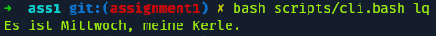

Next, I created the function `app-oq`. Here, the task was to make it possible to print out a daily quote from an online ressource into the terminal in a readable manner. The given ressource page was https://quotes.rest/. However the task also stated that it would be possible to choose another service aswell.\
The given website required authentication, so it would be quite inconvenient to use. A classmate has shown me another website that also provides quotes, and doesn't require login. The website [[26]](#references) is a quotes API and is much easier to integrate. Using [[26]](#references) and adding `quotes/random` at the end of the URL, will give us the link https://motivational-spark-api.vercel.app/api/quotes/random which is the link I used for this task as my source for online quotes. This site will display the author of the quote and the quote in a JSON format like this:\
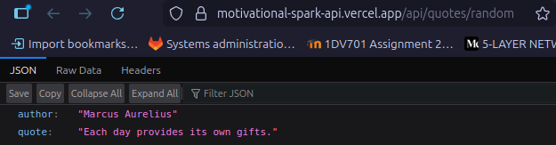\
To extract the quote alone, I used `jq`. This tool has to get installed first. I installed `jq` using the command `sudo apt install jq`.\
Of course, I could have red the jq user manual from https://jqlang.org/manual/ but the command [`tldr jq`](./images/extend_cli/tldr_jq.png) is giving me a nice summary of the most important usage ways. "tldr" stands for "too long didn't read" and can be installed onto the system using the terminal. It's like `man` but WAY MORE summarized.\
I also used [[25]](#references), which is an interactive guide for `jq`. After [experimenting and testing](./images/extend_cli/interactive.png) using [[25]](#references), I came to the final result, which is:
```bash
    function app-command2
    {
        curl 'https://motivational-spark-api.vercel.app/api/quotes/random' 2>/dev/null | jq '.["quote"]'
    }
```
Using `2>/dev/null`, I remove unnecessary output of `curl` and using `jq` like this, I only extract the `quote` from the site, which then gets printed.\
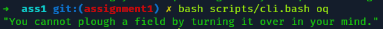\
I also extended the [helptext](./images/extend_cli/help.png) accordingly.

I noticed that `command2` doesn't work as intended (see image below).\
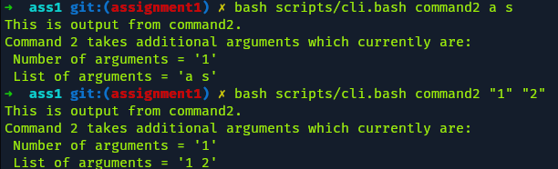\
The number of arguments is always 1 because the code line
```bash
    app-"$command" "$*"
```
is merging all arguments into one string, making it impossible to count properly. Replacing `*` with `@` like this:
```bash
    app-"$command" "$@"
```
results in proper argument count.\
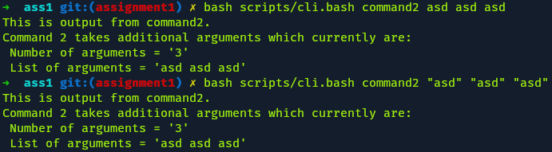\
I wasn't sure if this was part of the task but I changed it anyway, assuming it was not meant to behave that way.

### Questions
#### **Question 1:** Reflect on the cli code and compare it to other programming languages you have learnt. Talk about the similarity/differences and what is good/bad.
Compared to other languages, CLI code is quite hard to get used to. While other programming languages, like python, have simple syntax, CLI code has some cryptic syntax (e.g. double ";" or "(( ))"). However, there are similarities to languages like python and java. CLI code still has familiar code like `while`, `case`, and `if`/`else`, but in CLI code they need additional syntax like `while .. do .. done` or `case .. in .. esax`, which is not easy to get used to.\
Just like java, CLI code uses brackets for the conditions of if-statements, just a different type of brackets and some additional syntax.

What's good about CLI code is that you can write automated scripts to do things in one go and more convenient. You basically have quick access to a large number of tools/ commands with just a few commands needed to use them. You also don't have to compile anything like in e.g. cmake or java.\
The downsides are that you can destroy your system if you don't know what you are doing and for e.e.g operate as sudo user. However, developers knew that users can make mistakes and some UNIX systems implemented some command outputs that warn you before executing e.g. `rm -rf *`. There, the terminal will ask you if you for e.g. are sure that you want to proceed with your action.\
The syntax is also not easy to get used to sometimes, especially with all the large documentation that might be a little overwhelming for beginners.\
Personally, I think it's good for small tasks but can be really hard to maintain and debug for larger projects.

### Sourcecode
[cli.bash](./scripts/cli.bash)


## How to learn Linux
### **Question:** Lets say you have a friend that wants to learn Unix and the shell. What would be your suggestion to your friend on the five most important steps to start learning?
#### 1. The right Guidance
Do not watch these 12 hour tutorials or how others have their first experience. Most of these videos are really boring and you learn nothing and just end up getting frustrated because the people in the videos appear to be so much faster and display it much easier because they mostly cut out all the trial and error or have prior experience, they don't mention.\
Instead, focus on actual experience that you make yourself. Talk to real people that have knowledge and don't make everything sound so complicated. Talking to actual people and letting them explain things in simpler terms is much more useful than trying to understand all these guides that contain mostly academic and complex terminology or even assume you have prior knowledge. There are guides that are simple but they are hard to find. Therefore, I suggest finding the right group of people to help is always good.\
BUT it is also important that you find your own style of solving things at some point. It is okay when you let others help you get going and understand the foundamentals, but at some point you need to learn to do things on your own AND in your own way.
#### 2. Motivation/ Why?
Nothing really sticks if you don't have a motivation to do so or if the reason is just "I saw it on social media and i want to appear cool.". That's not really a valid reason that will keep you motivated for long. Trends die fast and then you end up moving on aswell. The motivation needs to be a little more personal then that, so it keeps you hooked. Remind yourself of this reason or these reasons every time, you planned a study session.
#### 3. Baby Steps and Burnout
Don't do everything at once or you'll end up getting overwhelmed and burned out. It is also crusial to not compare yourself to others. Some might learn everything in a day while others take a week or even more, and that's okay. If you need more time and aren't under time pressure because of an exam related to this topic, you have all the time in the world to do it in your own pace. "Never half-ass two things, whole-ass one thing."-Ron Swanson [Parks and Recreation](https://www.youtube.com/watch?v=k6hZ9KdG1QU).\
Set small goals that are so easy to do that it almost feels illegal. This way, you don't feel overwhelmed and don't try to procrastinate to avoid the task. If the task is simple and small to do, it may be a little easier to get started.\
However, planning these tasks might be harder, as when you start out, you might not understand the level of difficulty of each task. That's why you need the right guidance (see step 1).
#### 4. Don't use Windows
Personally, I think it's so inconvenient to have to install extra tools etc. just to have a terminal that still doesn't give you full freedom. The best way to learn UNIX and understand shell scripting is to actually not use windows, but installing a linux distribution.\
If you are unsure, you can always dual-boot windows and linux. It might seem overwhelming but it is actually not that scary or hard. My first dual-boot for e.g. was successful even without prior knowledge.\
There are many distributions and finding the right one is not an easy task but you can always dual boot and have multiple systems. Just start out with one distro and stay on it until you feel ready and more adventorous.\
For e.g. if you want to still do active gaming on your system, Cachy OS might be a good distro to choose. If you are completely new, are unsure of what to pick and want to start with something more familiar, Mint with Cinnamon is a good choice, as it looks similar to windows and still gives you the option to not use the terminal for everything, in case you are unsure of certain things.\
I would suggest to visit [url](https://www.heise.de/ratgeber/Der-c-t-Linux-Netzplan-So-finden-Sie-die-passende-Distribution-6330180.html) to get a good overview of some of the distros and what they entail. The website even provides sort of a train map to better visualize what the different distros have and don't have.
#### 5. Have fun
You should of course try to stay committed and serious about this, but also understand that this is not work, not something you HAVE to do (life or death situation). Understand that this is your decision and you can explore in your own way and make the system your own personal environment. You aren't restricted by any means. UNIX lets you explore many things in your own way and lets you change things that other systems don't want you to change.\
This is your chance to have more freedom to explore.

## ShellCheck
I first used the web version of it.
Sometimes it was really confusing. I had some odd encounters with this website. It told me for e.g. to add `""` around my variable, but when I did that, it told me to remove them. When I reverted it, it again told me to add the quotation marks. When clicked on "apply" inside the ShellCheck Output instead of fixing it manually and copy-pasting it back in the website, it didn't complain.\
Since, those encounters on the website were quite strange, I decided to just install it locally running

    sudo apt install shellcheck

in the terminal and adding an extention for it to VS Code. I tried to recreate the same issues as mentioned in the last paragraph, and it was much more consistent with its' complaints.

In the [last task](#extend-existing-example-script) I actually encountered a problem with shellcheck claiming that the provided functions from the template weren't invoked. Shellcheck technically understood that they might be used somewhere indirectly but still kept complaining. Therefore, I decided to ignore/ suppress this warning. This was the only warning I ignored because all functions were used, just that shellcheck doesn't always understand where or how and you can't just tell it that it is actually used.\
I wanted to ignore the warnings but since the blue marks were distracting, I suppressed them like this:\
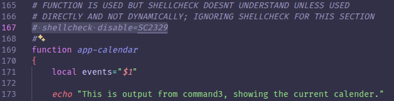\
I used these only in the functions of the script [cli.bash](./scripts/cli.bash). In case you want to remove them, they are in lines 105, 120, 137, 152, and 167 of [cli.bash](./scripts/cli.bash).\
This was the only case I encountered, where I ignored the warning.

## TIL _(Today I Learned...)_
Bash scripting is fun, if you don't have stress because of many deadlines (work, other courses etc.).\
I also leanred a lot about my terminal that I customized but forgot how. Writing it down was nice, since I can now look at this report in case I forget again.\
I learned a lot about bash scripting and the varieties and similarities to other languages and how to use the terminal more. The terminal has a lot of things to offer and I also lerned how to read guides a bit better. I also found this interesting tool (`tldr`), which is so much more convenient than `man`, when you don't have a lot of time to read everything.

Getting started was quite time consuming, and the first scripts took quite some time and were a little bit hard. Learning the syntax differences and some new commands, was a little demanding. Especially realizing a mistake and then having to rework the report aswell, was quite tedious.\
Writing the scripts and then the report was not an option for me, because I wanted to document my thoughts alongside writing the script or at least right after finishing a script, since it helps me understand, what I wrote, better, and organize my thoughts, or even finding mistakes in the code, when explaining it in the report.

I am personally quite proud of the little extention I wrote in [cli.bash](./scripts/cli.bash) and how I implemented [large_files.bash](./scripts/large_files.bash).\
While [large_files.bash](./scripts/large_files.bash) is not the most efficient code, it is something I made myself.\
[cli.bash](./scripts/cli.bash) was so short and easy to solve, once I understood the given script and task. I personally think, that my solution is quite elegant.\
Personally, all scripts are not bad. I am suprised that I even made it this far, considering that I don't have that much knowledge about bash scripting. But I also realized that I don't have no knowledge. Exchanging ideas with other students and then using the gained knowledge in the report has truly strengthen my understanding.\
Although, I might never fully get used to the syntax, since there are so many commands, I still learned a lot. For example I now understand more, how `tldr` works, how to use`if`/`else`-statements, `for`-loops, creating files, printing things in the files or in the terminal and how to remove not needed printouts or in particular, what `>/dev/null` means.

What I absolutely don't appreciate was IEEE referencing. Personally, writing the report, was quite enjoyable and will help me later when I need to come back to in someday, but I would have had much more fun, exploring the different ways of writing linux commands and scripts without having to refernce everything that I use to look up things. I always felt the need to justify where I found certain things. Referencing is okay, but I have a personal problem with this type of referencing.

What I did appreciate, were the questions that required personal experiences and possible knowledge from those experiences. It was also nice to use more cognitive skills like critical thinking to understand and see things from different perspectives.\
The assignment gave a lot of freedom when it came to the answering of the questions which was quite nice.

# References
[1] Sagar Sharma, "Find a Directory in Linux", "Linux Handbook", Jul 22, 2023. [Online]. Available: https://linuxhandbook.com/find-directory/ [Accessed: 23-Jan-2026]

[2] Lubos Rendek, "Try-Catch in Bash: Bash Script Error Handling", "LinuxConfig", Sep 21, 2025. [Online]. Available: https://linuxconfig.org/bash-script-error-handling-try-catch-in-bash [Accessed: 23-Jan-2026]

[3] Unkown, "Mastering the Linux \`find` Command for Directory Search", "LinuxVox.com", Nov 14, 2025. [Online]. Available: https://linuxvox.com/blog/linux-find-directory/ [Accessed: 23-Jan-2026]

[4] Monira Akter Munny, "How to Suppress Output in Bash [3 Cases With Examples]", "LinuxSimply", May 4, 2024. [Online]. Available: https://linuxsimply.com/bash-scripting-tutorial/input-output/output/suppress-output/ [Accessed: 23-Jan-2026]

[5] Rob Bednark and Daniel Kamil Kozar, "How can I calculate time elapsed in a Bash script?", "Stack Overflow", Mar 13, 2024. [Online]. Available: https://stackoverflow.com/questions/8903239/how-can-i-calculate-time-elapsed-in-a-bash-script [Accessed: 23-Jan-2026]

[6] Zach Bobbitt, "Bash: How to Add Timestamp to a Filename", "Collecting Wisdom", Aug 17, 2024. [Online]. Available: https://collectingwisdom.com/bash-add-timestamp-to-filename/ [Accessed: 23-Jan-2026]

[7] Aaron Kili, "How To Write and Use Custom Shell Functions and Libraries", "Tecmint", Feb 7, 2017. [Online]. Available: https://www.tecmint.com/write-custom-shell-functions-and-libraries-in-linux/ [Accessed: 23-Jan-2026]

[8] GeeksforGeeks, "mapfile Command in Linux With Examples", "GeeksforGeeks", Sep 5, 2024. [Online]. Available: https://www.geeksforgeeks.org/linux-unix/mapfile-command-in-linux-with-examples/ [Accessed: 25-Jan-2026]

[9] Dave McKay, "9 Examples of for Loops in Linux Bash Scripts", "How-To-Geek", Oct 30, 2023. [Online]. Available: https://www.howtogeek.com/815778/bash-for-loops-examples/

[10] Unkown, "How can I get the size of a file in a bash script?", "Unix&Linux Stack Exchange", Jul 13, 2011, modified Jan 18, 2024. [Online]. Available: https://unix.stackexchange.com/questions/16640/how-can-i-get-the-size-of-a-file-in-a-bash-script [Accessed: 25-Jan-2026]

[11] Auhona Islam, "8 Methods to Split String in Bash [With Examples]", "LinuxSimply", Apr 28, 2024. [Online]. Available: https://linuxsimply.com/bash-scripting-tutorial/string/split-string/ [Accessed: 25-Jan-2026]

[12] GeeksforGeeks, "How to Find Out File Types in Linux", "GeeksforGeeks", Sep 27, 2024. [Online]. Available: https://www.geeksforgeeks.org/linux-unix/how-to-find-out-file-types-in-linux/ [Accessed: 25-Jan-2026]

[13] Unkown, "Sorting and filtering in Bash", "Stack Overflow", Sep 3, 2013. [Online]. Available: https://stackoverflow.com/questions/18586948/sorting-and-filtering-in-bash [Accessed: 25-Jan-2026]

[14] GeeksforGeeks, "Write to a File From the Shell", "GeeksforGeeks", Jul 23, 2025. [Online]. Available: https://www.geeksforgeeks.org/techtips/write-to-a-file-from-the-shell/ [Accessed: 25-Jan-2026]

[15] Linux Bash, "Using \`wget\` and \`curl\` to Download Files from the Internet", "linuxbash", Jan, 2026. [Online]. Available: https://www.linuxbash.sh/post/using-wget-and-curl-to-download-files-from-the-internet [Accessed: 27-Jan-2026]

[16] Free Software Foundation, "Wget 1.25.0", "gnu.org", Nov 11, 2024. [Online]. Available: https://www.gnu.org/software/wget/manual/wget.html [Accessed: 27-Jan-2026]

[17] "revWhiteShadow", "How to Determine MIME Type of a File in Linux", "iTS FOSS", Nov 8, 2025. [Online]. Available: https://itsfoss.gitlab.io/post/how-to-determine-mime-type-of-a-file-in-linux/ [Accessed: 27-Jan-2026]

[18] GeeksforGeeks, "wc command in Linux with examples", "GeeksforGeeks", Nov 3, 2025. [Online]. Available: https://www.geeksforgeeks.org/linux-unix/wc-command-linux-examples/ [Accessed: 27-Jan-2026]

[19] "hek2mgl", "How to count all spaces in a file in Unix", "stackoverflow", Aug 15, 2019. [Online]. Available: https://stackoverflow.com/questions/18043260/how-to-count-all-spaces-in-a-file-in-unix [Accessed: 27-Jan-2026]

[20] Vivek Gite, "Linux / Unix: Display First Line of a File", "cyberciti", Feb 27, 2022. [Online]. Available: https://www.cyberciti.biz/faq/unix-linux-display-first-line-of-file/ [Accessed: 27-Jan-2026]

[21] LinuxVox, "Linux: Getting the Last N Lines of a File", "LinuxVox", Nov 14, 2025. [Online]. Available: https://linuxvox.com/blog/linux-get-last-n-lines-of-file/ [Accessed: 27-Jan-2026]

[22] psmears, "How to get only the first ten bytes of a binary file", "stackoverflow", Dec 2, 2025. [Online]. Available: https://stackoverflow.com/questions/4411014/how-to-get-only-the-first-ten-bytes-of-a-binary-file [Accessed: 27-Jan-2026]

[23] Packetlabs, "How Attackers Weaponize ANSI Escape Sequences", "Packetlabs", May 26, 2025. [Online]. Available: https://www.packetlabs.net/posts/weaponizing-ansi-escape-sequences/ [Accessed 10-Feb-2026]

[23] GeeksforGeeks, "Bash Scripting - Array", "GeeksforGeeks", Apr 13, 2022. [Online]. Available: https://www.geeksforgeeks.org/linux-unix/bash-scripting-array/ [Accessed 11-02-2026]

[24] Noah Cammann, "Dumme Sprüche", "1001SPRÜCHE", Apr 11, 2023. [Online]. Available: https://1001sprueche.com/dumme-sprueche [Accessed 11-02-2026]

[25] Navendu Pottekkat, "An Interactive Guide to Transforming JSON with jq", "navendu.me", Nov 22, 2024. [Online]. Available: https://navendu.me/posts/jq-interactive-guide/ [Accessed 11-02-2026]

[26] Subham Kumar Sinha, "Quotes API Documentation", "motivational-spark-api", 2025. [Online]. Available: https://motivational-spark-api.vercel.app/api/ [Accessed 11-02-2026]

# Other useful links
## Linux-related
https://itsfoss.com/display-linux-logo-in-ascii/ \
https://stackoverflow.com/questions/6212219/passing-parameters-to-a-bash-function \
https://pendrivelinux.com/how-to-open-a-tar-file-in-unix-or-linux/ \
https://www.geeksforgeeks.org/linux-unix/gzip-command-linux/ \
https://www.baeldung.com/linux/bash-count-lines-in-file

## IEEE usage
https://www.scribbr.com/ieee/ieee-paper-format/ \
https://docs.google.com/document/d/1j1L96U2NagwWI9MEVDNVKt9pXxRzTH7h3krI3Mb6wZE/edit?tab=t.0
